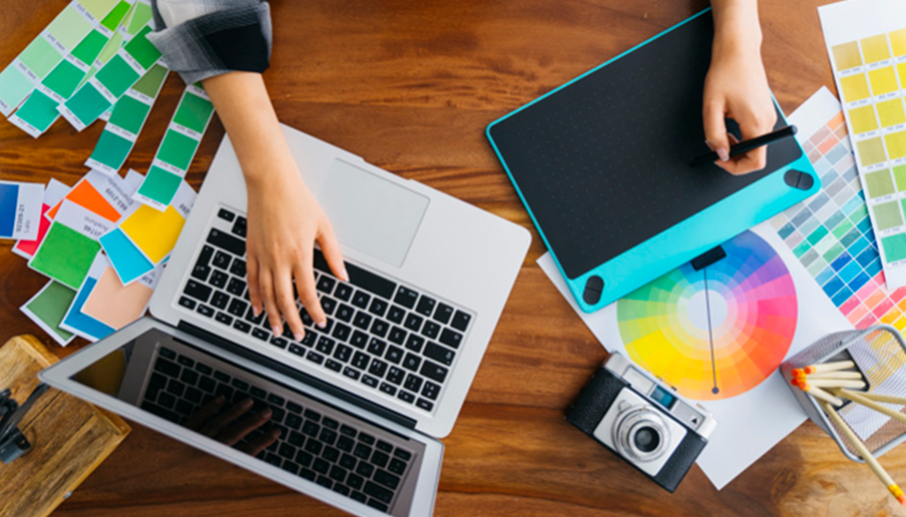
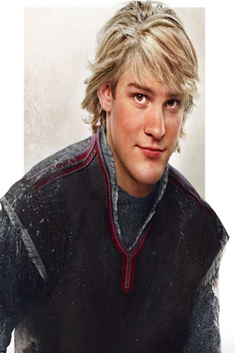
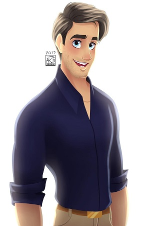
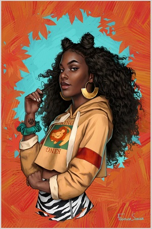

<!DOCTYPE html>
<html lang="pt">
<head>
<title>Grafica CEC</title>
    <meta charset="utf-8">
    <meta name="description" content="Grafica CEC"/>
	<meta name="developer" content="Crislaine de Oliveira Morais"/>
	<meta name="keywords" content="grafica, online,Taquaritinga"/>
	<meta name="viewport" content="width = device - width , initial-scale = 1.0"/>
	<link rel="icon" type="image/png" sizes="19x15" href="img/logo1.png">
	<!-- Bootstrap CSS -->
    <link rel="stylesheet" href="https://stackpath.bootstrapcdn.com/bootstrap/4.3.1/css/bootstrap.min.css" integrity="sha384-ggOyR0iXCbMQv3Xipma34MD+dH/1fQ784/j6cY/iJTQUOhcWr7x9JvoRxT2MZw1T" crossorigin="anonymous">
    <link rel="stylesheet" href="style.css">
	<!-- Fim Bootstrap CSS-->
	<!-- Pure-->
    <link rel="stylesheet" href="https://unpkg.com/purecss@1.0.0/build/pure-min.css" crossorigin="anonymous">
    <link rel="stylesheet" href="https://unpkg.com/purecss@1.0.0/build/grids-responsive-min.css">
	<!-- Fim Pure-->
	<!--CSS MEU-->
	<link rel="stylesheet" href="css/estilo.min.css">
	<!--Fim CSS MEU-->
</head>
<!--topo-->
	<body class="site">
	<nav class="navbar  nav-pills nav-fill fixed-top navbar-expand-lg bg-light"><!--para menu-->
			
		<ul class="nav nav-tabs">
			<li class="nav-item active"><a class="nav-link" href="#about" style ="color:#00FFFF" >Sobre</a></li>&ensp;	
			<li class="nav-item active"><a class="nav-link" href="#agenda" style ="color:#00FFFF">Orçamento</a></li>&ensp;	
			<li class="nav-item active"><a class="nav-link" href="#contato" style ="color:#00FFFF">Contato</a></li>&ensp;	
			<li class="nav-item active"><a class="nav-link" href="#equipe" style ="color:#00FFFF">Funcionarios</a></li>&ensp;	
			<li class="nav-item active"><a class="nav-link" href="#mapa" style ="color:#00FFFF">Localização</a></li>&ensp;	
		</ul>		
	</nav>
<!-- Fim Topo -->
<!--Logo da empresa-->
					<main class="site-conteudo">
						

						 &emsp; &ensp;
						

&emsp; &ensp;
						

&emsp; &ensp;
						

&emsp; &ensp;
						

&emsp; &ensp;
						

&emsp; &ensp;
						

&emsp; &ensp;
						

&emsp; &ensp;
						

&emsp; &ensp;
					

<!--FIM Logo da empresa-->
<!--Promoção empresa-->
		 
					<section class="noticias">
						

							

							 
							

<h2><strong>PROMOÇÃO 1º.</strong></h2> 

							<h1>500</h1>

	
							Cartão de visita
	
								<strong>R$ 200,00 reais</strong>	
					
							<button type="button" class="btn btn-outline-danger">Comprar</button>	
							
	
						

						

							

							 
							

<h2><strong>PROMOÇÃO 2º.</strong></h2> 

							<h1>1.000</h1>

	
							Cartão de visita

								<strong>R$ 500,00 reais</strong>	
				
							<button type="button" class="btn btn-outline-danger">Comprar</button>	
							

						

						

							

							 
							

<h2><strong>PROMOÇÃO 3º.</strong></h2> 

							<h1>10.000</h1>

	
							Cartão de visita
	
								<strong>R$ 800,00 reais</strong>	
	
							<button type="button" class="btn btn-outline-danger">Comprar</button>	
							
	
						

					</section>
					</main>
<!--FIM Promoção empresa-->
<!--HISTORIA DA EMPRESA-->
		<form class="footer l-box bg-light">	
			

				

<h3>Nossa Historia.</h3> 

					 

						

A CEC é a gráfica online que sabe exatamente do que você precisa. Além da característica peculiar de cada produto e preço baixo, ela também oferece comodidade e praticidade para navegar na loja. A CEC oferece também um vasto conjunto de variedades, são mais de 60 tipos de materiais impressos e cerca de 1000 unidades de retirada, para otimizar o seu tempo 

						   

 e seus negócios. Quer uma impressão perfeita? A CEC faz para você! Cuidar de cada detalhe do início ao fim do processo de produção é a nossa especialidade, e uma das principais razões que atraem clientes de todo o Brasil. É simplesmente a solução em Impressão Digital e Offset que você tanto procura!
							   A Gráfica disponibiliza modelos com designs

							

 bem modernos para atender às necessidades de cada cliente. Os produtos personalizados possuem acabamentos adaptados para todos os segmentos. Basta escolher o modelo  que  mais  agrada  seu  cliente   e   fazer   um compra fácil e rápida. Tecnologia, inovação e menor preço são peças-chave da Gráfica CEC Online, que sempre busca se atualizar no mercado
 

							

 alavancar as vendas e aumentar o lucro de seus parceiros. Todo revendedor gráfico ama receber um material personalizado com alto nível de qualidade e a curto prazo, com um simples clique. É por isso que a CEC faz questão de facilitar o trabalho de cada profissional e fica muito satisfeita por manter milhares de parcerias.

					 

			   

		</form>
<!--FINAL DA HISTORIA DA EMPRESA-->
<!--ORCAMENTO-->
		

			

				

					

						

							<form action="valida.jsp" method="post">
								

<h3>Orçamento.</h3> 

									
Use esse formulário para solicitar um orçamento de serviço.

										

										

										<label>Nome:</label>
										<input type="text" class="form-control border border-primary"  name="nome">
										

										

										<label>Telefone</label>
										<input type="text" class="form-control border border-primary" name="telefone">
										

										

									

										<label>Email:</label>
										

											

											@
											

											<input type="text" class="form-control border border-primary" name="email">
										
 
											<label class="form-inline" for="inlineFormCustomSelectPref">Tipo de serviço</label>
										<select class="custom-select my-1 mr-sm-2 border border-primary" id="inlineFormCustomSelectPref">
											<option value="1">Sacola</option>
											<option value="2">Embalagem</option>
											<option value="3">Publicação</option>
											<option value="4">Papelaria</option>
											<option value="5">Cartaz</option>
											<option value="6">Adesivo e rótulo</option>
											<option value="7">Diversos</option>
										</select>
										

											<input type="checkbox" class="custom-control-input" id="customControlInline">
											<label class="custom-control-label" for="customControlInline">Aceito</label>
										

										<button type="submit" class="btn btn-outline-warning">Enviar</button>
									

								

							</form>
						

					

				

			

		

<!--FINAL ORCAMENTO-->
<!--LOCALIZAÇÃO-->
		 
		
	 
				

<h3>Localização da grafica!</h3> 

				

					

						<iframe src="https://www.google.com/maps/embed?pb=!1m18!1m12!1m3!1d3714.937625803231!2d-48.49030818491621!3d-21.3923604909636!2m3!1f0!2f0!3f0!3m2!1i1024!2i768!4f13.1!3m3!1m2!1s0x94b939733f9a215d%3A0x6bd87b6cdf2e60c0!2sCrislaine+Morais!5e0!3m2!1spt-BR!2sbr!4v1554917972082!5m2!1spt-BR!2sbr"
						width="100%" height="450"  style="border:0" allowfullscreen></iframe><!--width:1300px-->
					

				

			
 
			
 
				

<h3>Equipe de trabalho.</h3> 

 
					

						

						
    
						

						<h1 class="font-italic font-weight-bold text-monospace" style ="color:#FF00FF" align="center">Grafica e editora CEC</h1> 
						
 O bom funcionamento de uma equipe vai depender da personalidade de cada elemento da equipe e do relacionamento entre eles. Alguns tipos de personalidade são mais compatíveis com outros e quando dois tipos de personalidade compatíveis trabalham juntos, a equipe sai beneficiada. Um ambiente saudável e agradável é também essencial para o trabalho em equipe. Desta forma, cada elemento deve colocar a equipe em primeiro lugar e não procurar os seus próprios interesses. Além disso, é importante haver empatia para que trabalho exercido seja o mais eficaz e prazeroso possível. Trabalhar em equipe requer muitas horas de convivência, e por isso, a harmonia e respeito devem ser cultivados em todas as ocasiões.

						
 
					
 
					

						

						
							<h5 class="card-title" style ="text-align:center">Crislaine Morais</h5>
							<h6 class="card-title" style ="text-align:center">Presidente</h6>
						

						

						
							<h5 class="card-title" style ="text-align:center">Adriano Novacki</h5>
							<h6 class="card-title" style ="text-align:center">Design Digital</h6>
						

						

						
							<h5 class="card-title" style ="text-align:center">Adrian Novacki</h5>
							<h6 class="card-title" style ="text-align:center">Programador</h6>
						

						

						
							<h5 class="card-title" style ="text-align:center">Aline Oliveira</h5>
							<h6 class="card-title" style ="text-align:center">Design Digital</h6>
						

					

			

		 			
<!--FINAL LOCALIZAÇÃO-->	
<!--RODAPÉ-->
		
 
		 
			

			  

				

				<strong>Localização</strong> 
				<strong>Rua:</strong> Sebastião Batista n: 25 Jardim Ignes. Taquaritinga – SP – 15900-000
				
      
			  

				

					

					
<strong>Telefone:</strong> (16) 3252-3383

					

					
<strong>Celular:</strong> (16) 9.8852-1464

				

				

					

						<strong>Horario de Atendimento:</strong> 
						
Segunda  - Sexta: 08hrs as 18hrs 
						Sábado - Domingo: 08hrs as 13hrs

					

				

			

		

		 	
			

				Copyright 2019&emsp;  <a href="#" class="text-reset"> &copy;Grafica e editora CEC - Taquaritinga.</a>
			

<!--FIM RODAPÉ-->
	</body>
</html>
